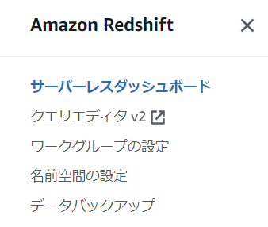

# Amazon Redshift Serverless を触ってみよう

このワークでは、Redshift Serverless のデータウェアハウスを作成し、クエリエディタからクエリを発行します。

このワークの環境はトレーニングのラボとは異なり、**ワーク実施時間のみ使用可能です。**

---

## 準備

1. 講師のガイドに基づき、AWS マネジメントコンソールにサインインします。

1. AWS マネジメントコンソールで、東京リージョンを指定し、`Redshift` のコンソールを表示します。

1. **サーバーレスダッシュボード** の表示を確認します。
  - **サーバーレスダッシュボード** が表示されない場合は、左側のナビゲーションペインから **サーバーレスダッシュボード** のメニューをクリックします。
    - ナビゲーションペインは、横三本線のアイコンをクリックしないと表示されない場合があります。



---

## ワークグループと名前空間の作成

1. ページ右上にある **ワークグループの作成** をクリックします。

1. **ワークグループの名前** を下記のように入力します。**99 の部分はご自分の数字に書き換えて下さい。**
    - `student99-wg`

1. **ベース RPU 容量** のリストから **8** を選択します。

1. **ネットワークとセキュリティ** の設定は、このワークではデフォルトのままにします。

1. ページ右下にある **次へ** をクリックします。

1. **新しい名前空間を作成** を下記のように入力します。**99 の部分はご自分の数字に書き換えて下さい。**
    - `student99-ns`

1. **データベース名とパスワード** は、このワークではデフォルトのままにします。

1. **許可** で 表示されている IAM ロールの左横のチェックボックスをチェックします。

1. **暗号化とセキュリティ** は、このワークではデフォルトのままにします。

1. ページ右下にある **次へ** をクリックします。

1. ページ右下にある **作成** をクリックします。

1. ワークグループと名前空間の作成が完了するまで数分待ちます。

---

## クエリエディタの使用

1. クエリエディタを使用し、テーブルを作成してデータをロード、その後クエリを発行します。これは、下記のドキュメントに記載されている内容を基にしています。
    - https://docs.aws.amazon.com/ja_jp/redshift/latest/gsg/new-user-serverless.html#serverless-load-data-from-s3


1. **サーバーレスダッシュボード** ページの右上にある **クエリデータ** をクリックします。

1. ページ左側のリストから、ご自分が作成したワークグループ名をクリックします。
    - 例：student99 の ID をご使用の場合、`Serverless: student99-wg` をクリックします。　 

    

1. **Edit Connection** のダイアログで **Federated user** が選択されていることと、**Database** に **dev** が入力されていることを確認し、**Create Connection** をクリックします。

    

1. ページ右側にエディタのタブ **Untitled 1** が表示されることを確認します。
    - 赤色のメッセージが表示された場合は、X をクリックして非表示にして下さい。

1. エディタのタブ **Untitled 1** に下記の CREATE TABLE 文を貼り付け、上側にある　**Run** をクリックします。

    ```
    create table users(
    userid integer not null distkey sortkey,
    username char(8),
    firstname varchar(30),
    lastname varchar(30),
    city varchar(30),
    state char(2),
    email varchar(100),
    phone char(14),
    likesports boolean,
    liketheatre boolean,
    likeconcerts boolean,
    likejazz boolean,
    likeclassical boolean,
    likeopera boolean,
    likerock boolean,
    likevegas boolean,
    likebroadway boolean,
    likemusicals boolean);                        

    create table event(
    eventid integer not null distkey,
    venueid smallint not null,
    catid smallint not null,
    dateid smallint not null sortkey,
    eventname varchar(200),
    starttime timestamp);

    create table sales(
    salesid integer not null,
    listid integer not null distkey,
    sellerid integer not null,
    buyerid integer not null,
    eventid integer not null,
    dateid smallint not null sortkey,
    qtysold smallint not null,
    pricepaid decimal(8,2),
    commission decimal(8,2),
    saletime timestamp);

    ```

1. ページ下部に 3 つの **Result** タブが表示されるので、結果を確認します。

1. エディタのタブ **Untitled 1** の左にある **+** をクリックして **Editor** メニューを選択し、新しいタブを追加します。

1. 新しいエディタで、下記の COPY 文を貼り付け、上側にある　**Run** をクリックします。

    ```
    COPY users 
    FROM 's3://redshift-downloads/tickit/allusers_pipe.txt' 
    DELIMITER '|' 
    TIMEFORMAT 'YYYY-MM-DD HH:MI:SS'
    IGNOREHEADER 1 
    REGION 'us-east-1'
    IAM_ROLE default;                    
                        
    COPY event
    FROM 's3://redshift-downloads/tickit/allevents_pipe.txt' 
    DELIMITER '|' 
    TIMEFORMAT 'YYYY-MM-DD HH:MI:SS'
    IGNOREHEADER 1 
    REGION 'us-east-1'
    IAM_ROLE default;

    COPY sales
    FROM 's3://redshift-downloads/tickit/sales_tab.txt' 
    DELIMITER '\t' 
    TIMEFORMAT 'MM/DD/YYYY HH:MI:SS'
    IGNOREHEADER 1 
    REGION 'us-east-1'
    IAM_ROLE default;

    ```

1. ページ下部に 3 つの **Result** タブが表示されるので、結果を確認します。

1. エディタのタブ **Untitled 1** の左にある **+** をクリックして **Editor** メニューを選択し、新しいタブを追加します。

1. 新しいエディタで、下記の SELECT 文を貼り付け、上側にある　**Run** をクリックします。

    ```
    -- Find top 10 buyers by quantity.
    SELECT firstname, lastname, total_quantity 
    FROM   (SELECT buyerid, sum(qtysold) total_quantity
            FROM  sales
            GROUP BY buyerid
            ORDER BY total_quantity desc limit 10) Q, users
    WHERE Q.buyerid = userid
    ORDER BY Q.total_quantity desc;

    -- Find events in the 99.9 percentile in terms of all time gross sales.
    SELECT eventname, total_price 
    FROM  (SELECT eventid, total_price, ntile(1000) over(order by total_price desc) as percentile 
        FROM (SELECT eventid, sum(pricepaid) total_price
                FROM   sales
                GROUP BY eventid)) Q, event E
        WHERE Q.eventid = E.eventid
        AND percentile = 1
    ORDER BY total_price desc;

    ```

1. ページ下部に 2 つの **Result** タブが表示されるので、結果を確認します。

---
## RPU の使用量のモニタリング

1. ブラウザで、**Redshift サーバーレス** のタブに戻ります。

1. 左側のナビゲーションメニューから **サーバーレスダッシュボード** をクリックします。

1. ページを下にスクロールして、**使用される RPU 容量** セクションを表示します。

1. ワークグループ名が表示されているドロップダウンリストから、自分のワークグループ名を選択します。

1. 使用された RPU の容量をチャートで確認します。

---

## ワークグループの削除

1. ブラウザで、 **サーバーレスダッシュボード** のタブに戻ります。

1. **名前空間 / ワークグループ** のリストからご自分が作成したワークグループの名前のリンクをクリックします。

1. ワークグループのページの右上の **アクション** から、**ワークグループの削除 (Delete workgroup)** をクリックします。

1. `削除` 入力して **削除** をクリックします。(名前空間は後で講師が削除するので、そのままで結構です。)

1. AWS マネジメントコンソールからサインアウトします。

### お疲れ様でした！
